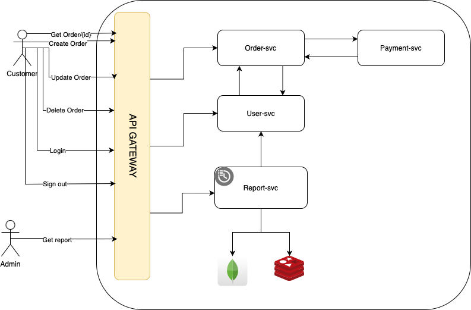

# Order Management System


## Installation  Guide
### Prerequisite.
- Docker
- docker-compose

### Development environment
You can use docker compose file with Remote access plugin at vscode to access targeted container

```sh
> docker compose up --build -d
```

### System endpoints
Please Find attached Postman collection at resources folder.

### Tasks
* [X] Design a database schema
* [X] Write an application
* [X] API endpoint for verifying and bodies
* [X] Cache Reports with redis
* [X] Validate Payment method using Payment service using TCP
* [X] Docker file to setup the whole application with all the dependencies (database, nodejs)
* [X] Create Docker Compose to run application
* [] Create Role Based to validte client identity 
* [] Create API Gateway to send rpcs to targeted services
* [] Enhance Error Handling To handle RPC Exceptions 80%.